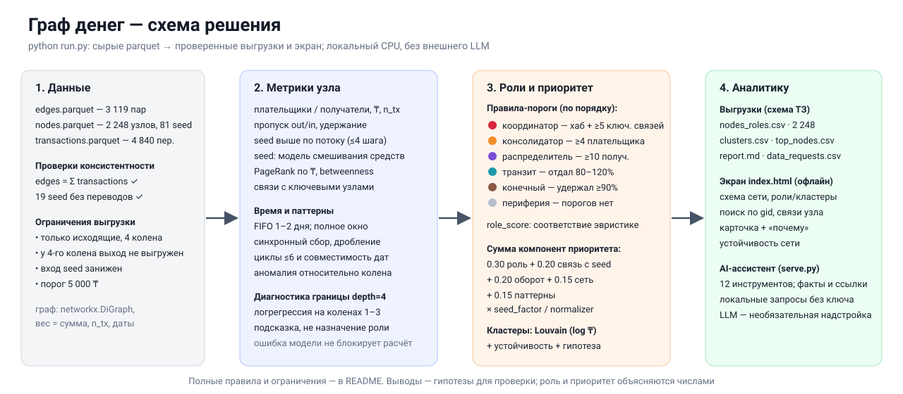
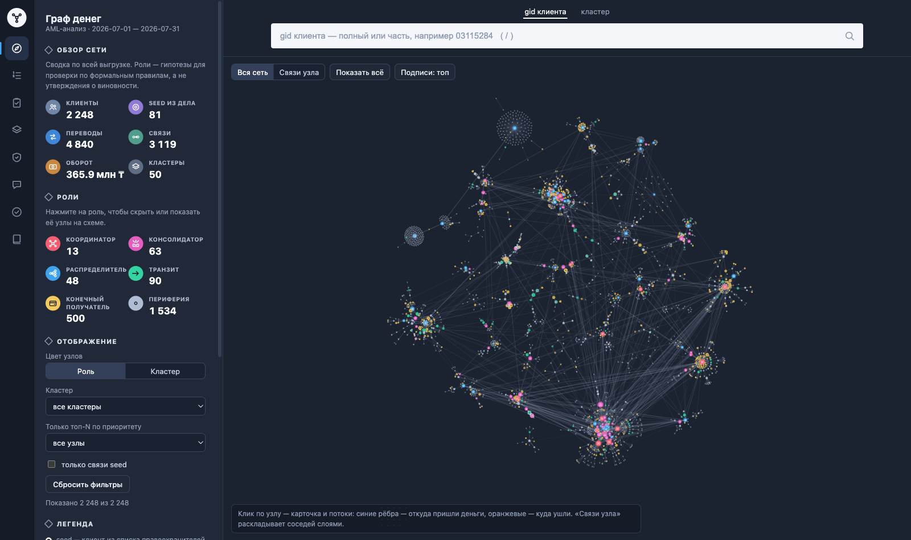
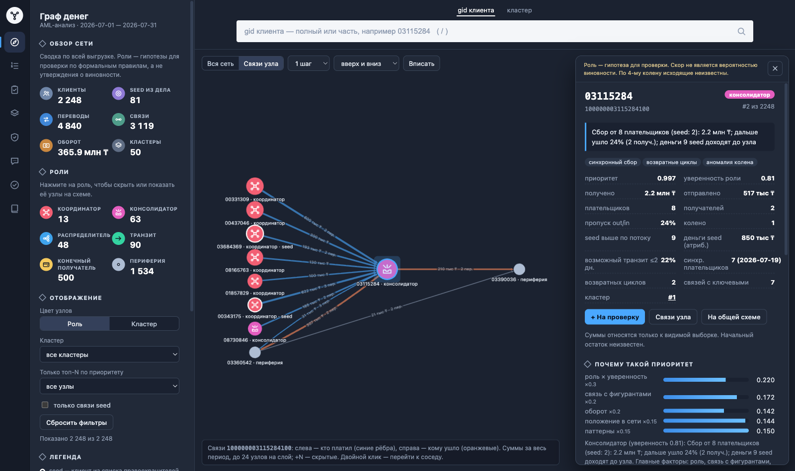
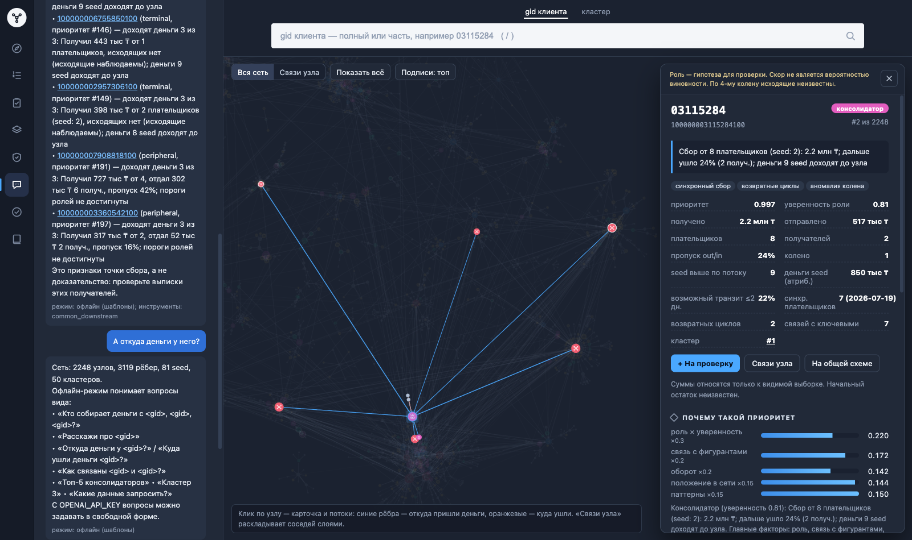

# Граф денег

**Восстановление финансовой структуры группы по транзакционной сети** — аналитический инструмент (пайплайн + экран просмотра) для кейса «Граф денег».

По выгрузке переводов клиентов из дела инструмент за несколько секунд строит граф, присваивает каждому клиенту роль с числовым обоснованием, ранжирует клиентов по приоритету проверки, выделяет кластеры и показывает сеть на интерактивной схеме. Все выводы сформулированы как **признаки и гипотезы для проверки**, а не как утверждения о виновности.



## Содержание

- [Описание](#описание)
- [Что реализовано](#что-реализовано)
- [Как работает решение](#как-работает-решение)
- [Технологии](#технологии)
- [Архитектура проекта](#архитектура-проекта)
- [Установка и запуск](#установка-и-запуск)
- [Как проверить решение](#как-проверить-решение)
- [Данные и интеграции](#данные-и-интеграции)
- [Ограничения](#ограничения)
- [Deployed-версия](#deployed-версия)

---

## Описание

**Для кого.** AML-аналитик — специалист подразделения финансового мониторинга банка.

**Проблема.** По делу аналитику известен только нижний уровень цепочки — 81 клиент (seed) из списка правоохранительных органов. Выгрузка их исходящих переводов на 4 колена даёт сеть из 2 248 клиентов. Кто в этой сети собирает деньги, через кого они проходят и кто ими распоряжается, приходится восстанавливать вручную, а порядок проверки выбирается без ранжирования.

**Что даёт инструмент.** На вопрос «кого из 2 248 клиентов смотреть первым и почему» инструмент отвечает готовой моделью структуры группы:

- роль каждого узла по формальному правилу: точка консолидации, транзит, распределитель, конечный получатель, координатор, периферия;
- ранжированный список приоритетов с обоснованием в числах;
- кластеры с гипотезой о назначении каждого;
- схема сети с направлением денег;
- список клиентов для углублённой проверки с рекомендуемыми запросами данных.

## Что реализовано

### Расчёт

- **Один запуск** `python run.py`: от трёх исходных parquet до всех выгрузок и экрана просмотра без ручных шагов. До расчёта проверяется консистентность входных данных, после — все выгрузки по требованиям ТЗ (29 проверок).
- **Роль каждого из 2 248 узлов** по формальным правилам с порогами из `moneygraph/config.py`: `role`, `role_score` (0–1) и `evidence` (до 200 символов, всегда с числами).
- **Приоритет** `priority_score` (0–1) из пяти интерпретируемых компонент и текстовое обоснование `why`: роль, главные факторы, признаки, что проверить.
- **Кластеры** (Louvain): размер, число seed, внутренний оборот, устойчивость к перезапускам алгоритма, гипотеза о назначении.
- **Модель обрыва 4-го колена**: логистическая регрессия отличает вероятных настоящих конечных получателей от узлов, на которых просто закончился обход.
- **Временные и структурные паттерны**: возможный сквозной транзит за ≤2 дня (FIFO), синхронный сбор от нескольких плательщиков в один день, всплески активности, устойчивые маршруты A→B→C, возвратные циклы, дробление, аномалии относительно своего колена.
- **Устойчивость сети**: что произойдёт со связностью сети при блокировке N узлов по четырём стратегиям.
- **Оценка полноты**: какие данные и по какому gid запросить дальше (`data_requests.csv`).
- **Паспорт воспроизводимости** `validation.json`: результаты проверок, время пересчёта, версии библиотек, параметры, SHA-256 входных и выходных файлов.

### Экран просмотра

Один самодостаточный файл `out/index.html`: библиотека Cytoscape.js встроена в него, страница работает офлайн.

- **Схема сети**: стрелки показывают направление перевода, цвет — роль или кластер, размер — приоритет, толщина ребра — сумма. Seed отмечены белым кольцом, узлы 4-го колена без выгруженных исходящих — пунктиром. Есть фильтры по роли, кластеру, топ-N и связям seed.
- **Поиск** (клавиша `/`) по полному gid или его части, а также по кластеру — по номеру или типу. Ссылка `index.html#<gid>` сразу открывает карточку клиента.
- **Связи узла**: послойная схема «плательщики → узел → получатели» на 1–3 шага с суммами на рёбрах. Двойной клик по соседу переносит фокус на него.
- **Карточка клиента**: роль и обоснование, какие ещё правила выполнены, флаги паттернов, метрики, разложение приоритета по компонентам, динамика по дням, плательщики и получатели, устойчивые маршруты через узел, каких данных не хватает, кластер.
- **Разделы**: Обзор, Топ, Проверка, Кластеры, Устойчивость, AI-ассистент, Качество, Методика. Правила во вкладке «Методика» берутся из того же `config.py`, что и в расчёте.
- **Список углублённой проверки**: выбор клиентов, статусы («К проверке», «Запрошены данные», «Рассмотрен»), заметки. Список выгружается в CSV, JSON и справку в Markdown, JSON можно загрузить обратно. Хранится в браузере отдельно для каждой выгрузки.
- **Скачивание выгрузок** (три обязательные CSV, запросы данных, справка) прямо со страницы, без сервера.

| Вся сеть | Связи узла |
|-|-|
|  |  |

### AI-ассистент аналитика

Работает через `python serve.py`: на экране это вкладка «AI-ассистент» на панели слева — поле для вопроса и готовые вопросы-кнопки. Если открыть `out/index.html` без сервера, вкладка подскажет запустить `python serve.py`.

- Вопрос на естественном языке → ответ по графу со ссылками на узлы. В ответе gid кликабельны: клик открывает карточку.
- **LLM-агент** (OpenAI Chat Completions с function calling) вызывает 8 инструментов над графом. Данные графа модель получает только через результаты инструментов; системный промпт запрещает выдумывать gid и суммы и требует формулировок «признаки / гипотеза».
- **Офлайн-режим** без ключа: типовые вопросы разбираются по шаблонам теми же инструментами. При ошибке API ассистент автоматически отвечает в офлайн-режиме.
- **Контекст экрана**: «эти», «выбранные», «из списка» — клиенты на вкладке «Проверка», «этот узел» — открытая карточка. Поэтому вопрос «Кто собирает деньги с этих пятерых?» работает и офлайн, и с LLM.

| Инструмент | Что делает |
|-|-|
| `node_card` | карточка узла: роль, обоснование, суммы, плательщики и получатели, всплеск, устойчивые маршруты, пробелы в данных |
| `common_downstream` | кто собирает деньги с нескольких узлов: общие получатели, прямые и через ≤3 перевода |
| `trace` | откуда пришли / куда ушли деньги, 1–3 шага |
| `path_between` | кратчайшая денежная цепочка между двумя узлами в обе стороны |
| `top_nodes`, `cluster_info`, `data_gaps`, `network_summary` | топ с фильтрами, описание кластера, запросы данных, сводка по сети |

**Какие вопросы понимает офлайн-режим** (без ключа). gid можно писать полностью или 8 цифрами из середины (`08603629`):

| Вопрос | Ответ |
|-|-|
| «Кто собирает деньги с 100000000343175100, 100000000331309100, 100000000437046100?» или «Кто собирает деньги с этих троих?» (клиенты со вкладки «Проверка») | общие получатели: прямые и через ≤3 перевода |
| «Расскажи про 100000008603629100» или «Расскажи про этот узел» (открытая карточка) | роль, обоснование, главные плательщики и получатели, пробелы в данных |
| «Откуда деньги у 100000003115284100?» / «Куда ушли деньги 100000008603629100?» | переводы на 2 шага вверх или вниз по цепочке |
| «Как связаны 100000008603629100 и 100000000331309100?» | кратчайшая денежная цепочка в обе стороны |
| «Топ-5 консолидаторов», «Кого проверять первым?» | топ по приоритету, можно с ролью |
| «Кластер 3» | гипотеза и ключевые узлы кластера |
| «Какие данные запросить?» | запросы недостающих данных по gid |
| «Что с обрывом 4-го колена?» | сводка модели обрыва |

На другие вопросы офлайн-режим отвечает сводкой по сети и списком поддерживаемых формулировок. С LLM вопросы можно задавать в свободной форме.



## Как работает решение

### Сценарий аналитика

1. **Вход.** Три parquet-файла выгрузки (`nodes`, `edges`, `transactions`) лежат в `data/` или в любой папке, которую передают через `--data`.
2. **Пересчёт.** `python run.py` проверяет данные, строит граф, считает признаки, присваивает роли и приоритеты, выделяет кластеры, пишет выгрузки и сам сверяет их с требованиями ТЗ. На предоставленных данных это занимает около 4.5 с.
3. **Обзор сети.** Аналитик открывает `out/index.html` (или `python serve.py`, если нужен ассистент) и видит схему с направлением потоков, ролями и кластерами.
4. **Приоритеты.** Во вкладке «Топ» узлы отсортированы по `priority_score`. Карточка объясняет, по какому правилу присвоена роль и из чего сложился приоритет, а «Связи узла» показывают, откуда пришли и куда ушли деньги.
5. **Результат.** Аналитик добавляет клиентов на «Проверку», ставит статусы и заметки, задаёт вопросы ассистенту и выгружает список и справку с рекомендуемыми запросами данных. Решение о запросе в правоохранительные органы остаётся за аналитиком.

### Этапы расчёта

```
data/*.parquet
  → load.py        проверки схемы и консистентности, граф networkx.DiGraph
  → features.py    степени, суммы, атрибуция денег seed, PageRank, betweenness,
                   время (FIFO, синхронность, всплески), маршруты, циклы, аномалии
  → truncation.py  модель обрыва 4-го колена: P(узел передаёт деньги дальше)
  → roles.py       правила ролей → role, role_score, evidence, флаги
  → priority.py    priority_score и why
  → clusters.py    Louvain, устойчивость, гипотезы
  → resilience.py  симуляция блокировок
  → report.py      data_requests.csv и report.md
  → export.py      три CSV фиксированной схемы ТЗ + их проверка
  → viewer.py      out/index.html
  → validation.py  out/validation.json
```

### Роли: формальные правила и пороги

Правила проверяются **сверху вниз**, основной ролью становится первая выполненная. Остальные выполненные правила сохраняются в `role_secondary` и показываются в карточке. «Ключевые узлы» — хабы, консолидаторы и распределители. Все пороги задаются в `moneygraph/config.py`.

| Роль | Правило | Узлов |
|-|-|-|
| **coordinator** — координатор | ≥5 плательщиков **и** ≥10 получателей (хаб) **и** ≥5 прямых связей с другими ключевыми узлами | 13 |
| **consolidator** — точка консолидации | ≥4 разных плательщика (или ≥3, из них ≥2 seed) и плательщиков ≥ получателей; либо хаб, у которого получателей меньше 2× плательщиков | 63 |
| **distributor** — распределитель | ≥10 получателей и получателей ≥3× плательщиков; либо хаб, у которого получателей ≥2× плательщиков | 48 |
| **transit** — транзит | не seed, исходящие наблюдаемы (колена 0–3); отдал 80–120% полученного **или** ≥60% полученного ушло за ≤2 дня при пропуске 0.5–2.0; через узел прошло ≥20 тыс ₸. Для seed: переправил ≥100 тыс ₸ не более чем 9 получателям | 90 |
| **terminal** — конечный получатель | исходящие наблюдаемы, дальше ушло ≤10% полученного; получил ≥100 тыс ₸, или от ≥2 плательщиков, или ≥3 поступлений. На 4-м колене — только при P(сток) ≥ 0.6 по модели обрыва | 500 |
| **peripheral** — периферия | ни одно правило не выполнено | 1 534 |

- **role_score** = 0.5 + 0.5 × сила признака. Сила — формула с насыщением по лог-шкале: например, у консолидатора она растёт с числом плательщиков, долей входящих связей и числом seed среди плательщиков. У терминалов 4-го колена весь скор умножается на P(сток). У периферии уверенность тем выше, чем дальше узел от порогов; у 19 seed без переводов она равна 0.3. Это сила соответствия правилу, а не вероятность роли и не вероятность виновности.
- **evidence** — обоснование с числами, например:
  - `Хаб: 19 плательщиков → 61 получатель; вход 1.8 млн ₸, выход 5 млн ₸; связан с 19 ключевыми узлами; возвратных циклов: 96`
  - `Сбор от 7 плательщиков (seed: 6): 393 тыс ₸; дальше ушло 13% (1 получ.); к узлу ведут цепочки переводов от 11 seed`
  - `4-е колено, исходящие не выгружены; модель: P(сток)=0.66; получил 1.8 млн ₸ от 1 плательщика`

### Приоритет

```
priority = 0.30·роль + 0.20·связь с фигурантами + 0.20·оборот + 0.15·положение в сети + 0.15·паттерны
```

| Компонента (0..1) | Как считается |
|-|-|
| роль | вес роли × role_score. Веса: координатор 1.0, консолидатор 0.9, распределитель 0.75, конечный получатель 0.6, транзит 0.55, периферия 0.1 |
| связь с фигурантами | ½ · (от скольких seed к узлу ведут цепочки переводов, 1→12) + ½ · (деньги seed по пропорциональной атрибуции, 10 тыс → 2 млн ₸), лог-шкала |
| оборот | max(вход, выход), 50 тыс → 10 млн ₸, лог-шкала |
| положение в сети | ½ · процентиль PageRank по суммам + ½ · процентиль betweenness |
| паттерны | число флагов / 4 (не больше 1): быстрый транзит, синхронный сбор, возвратные циклы, аномалия колена, повторяющиеся маршруты, дробление |

Затем приоритет seed умножается на 0.85: они уже известны правоохранительным органам, поэтому при равных признаках выше ставятся новые узлы. Итог делится на максимум. В топ-20 — 17 новых (не seed) узлов. Всплеск активности — информационный флаг, в приоритет не входит: он пересекается с синхронным сбором и быстрым транзитом, которые уже учтены.

### Кластеры

Louvain на неориентированной проекции графа с весом ребра log(1 + сумма / 5 000). Направление в кластерах сознательно не учитывается: оно учтено в ролях. Результат — 49 сообществ и служебный кластер 0 для 19 узлов без переводов, модулярность 0.802. Louvain перезапускается ещё 10 раз с другими random seed, и для каждого кластера считается устойчивость (средний Jaccard с лучшим совпадением). Гипотеза выводится из состава ролей: *ядро*, *контур сбора*, *веерные выплаты*, *транзитная цепочка*, *граница выборки*, *периферия*. У кластеров с устойчивостью ниже 0.5 в гипотезе есть оговорка, что их границы условны.

### Модель обрыва 4-го колена

444 узла 4-го колена не имеют исходящих только потому, что обход на них закончился. Логистическая регрессия обучена на 1 723 узлах 1–3 колена (у них исходящие наблюдаемы, доля узлов без исходящих — 63%) и только по признакам входящей стороны, которые у 4-го колена видны так же. ROC-AUC на 5-кратной кросс-валидации — 0.72, Brier — 0.195 против 0.234 у постоянного прогноза. Ожидаемо настоящих стоков среди обрезанных узлов ≈267. Конечными получателями становятся только 75 узлов с P(сток) ≥ 0.6 и существенным входом, а не все 444, как дало бы наивное правило «нет исходящих ⇒ сток».

### Как учтены ограничения выгрузки

| Ограничение | Как учтено |
|-|-|
| Обрыв на 4-м колене: 444 узла без исходящих | модель обрыва; у остальных обрезанных узлов роль «периферия» с флагом `обрыв_4_колена` и запрос исходящих 5-го колена при существенном входе |
| Только исходящие переводы: вход узла — нижняя оценка | превышение выхода над входом может объясняться невидимыми поступлениями или начальным остатком; такие узлы получают запрос выписок (184 узла) |
| Вход seed занижен | пропуск out/in у seed не используется для роли транзита; для seed отдельное правило передачи средств |
| Порог 5 000 ₸ | дробление ниже порога не детектируется; детектируется «несколько переводов одному получателю в один день» |
| 19 seed без переводов, 12 seed только получают | 19 — служебный кластер 0 и запрос межбанка и наличных; получающие seed обрабатываются общими правилами |
| Сеть не монолитна: 16 компонент с рёбрами + 19 изолятов | Louvain не объединяет несвязные части; устойчивость кластеров выводится отдельно |
| Нет размеченных ролей | роли — формальные правила, а не обученный классификатор; соответствие правилам проверяется тестами |

## Технологии

| Часть | Технологии |
|-|-|
| Язык расчёта | Python 3.11+ (проверено на 3.11, 3.13 и 3.14) |
| Данные | pandas, pyarrow (чтение parquet), numpy |
| Граф и алгоритмы | networkx: ориентированный граф, PageRank, betweenness, Louvain, простые циклы, кратчайшие пути; scipy.sparse — атрибуция денег seed как неподвижная точка линейной системы |
| ML | scikit-learn: логистическая регрессия, стратифицированная кросс-валидация, ROC-AUC и Brier (модель обрыва 4-го колена) |
| Экран просмотра | HTML, CSS и JavaScript без фреймворков; визуализация графа — Cytoscape.js 3.34.3 (MIT), встроен в страницу |
| Сервер | стандартная библиотека Python (`http.server`), только 127.0.0.1 |
| AI | опционально: OpenAI Chat Completions API с function calling, модель по умолчанию `gpt-5.4` (меняется через `OPENAI_MODEL`); через `OPENAI_BASE_URL` — любой OpenAI-совместимый сервер. Без ключа — офлайн-режим на шаблонах |
| Тесты | pytest (78 тестов), Node.js 22 `node --test` (4 теста) |
| CI | GitHub Actions, workflow `Verify requirements` с ручным запуском |

Точные версии проверенного окружения — в `requirements.lock`: pandas 3.0.6, pyarrow 25.0.1, networkx 3.7, numpy 2.5.3, scipy 1.18.1, scikit-learn 1.9.1.

## Архитектура проекта

```
run.py                 один запуск: parquet → out/ (+ проверка выгрузок по ТЗ)
serve.py               тот же пересчёт + локальный сервер экрана и AI-ассистента
moneygraph/
  config.py            все пороги и веса
  load.py              загрузка parquet, проверки консистентности, граф
  features.py          признаки узлов: структура, деньги seed, центральность, время, маршруты, циклы, аномалии
  truncation.py        модель обрыва 4-го колена
  roles.py             правила ролей, role_score, evidence, флаги
  priority.py          priority_score и why
  clusters.py          Louvain, устойчивость, гипотезы
  resilience.py        симуляция блокировок
  report.py            report.md и data_requests.csv
  export.py            три CSV фиксированной схемы ТЗ и их проверка
  validation.py        validation.json: время, версии, параметры, SHA-256
  viewer.py            раскладка графа и сборка index.html
  assistant.py         инструменты над графом, LLM-агент, офлайн-режим
  fmt.py               форматирование сумм и согласование числительных
  pipeline.py          порядок шагов расчёта
viewer/
  template.html        интерфейс экрана просмотра
  review.js            список проверки: восстановление и безопасный экспорт CSV
  vendor/              Cytoscape.js (MIT)
tests/                 pytest и node --test
docs/                  схема решения, скриншоты, сценарий демо, аудит требований ТЗ
data/                  исходные parquet и описание датасета
starter/               стартовый код организаторов (решение его не использует)
out/                   выгрузки последнего пересчёта
```

**Как взаимодействуют компоненты:**

- `run.py` вызывает `pipeline.run()`: расчёт идёт по шагам из раздела «Этапы расчёта», затем пишутся выгрузки, выполняются проверки ТЗ, генерируются `report.md`, `index.html` и `validation.json`. При непройденной проверке `run.py` завершается с ошибкой.
- `viewer.py` встраивает в `index.html` данные расчёта (узлы, рёбра, переводы по дням, кластеры, устойчивость, правила, результаты проверок) и Cytoscape.js. Поэтому страница не обращается ни к серверу, ни к интернету.
- `serve.py` выполняет тот же пересчёт, держит граф в памяти и раздаёт `out/`. Маршрут `POST /api/ask` принимает вопрос, последние 6 реплик и контекст экрана (список проверки и открытую карточку) и передаёт их ассистенту. Сервер слушает только 127.0.0.1, проверяет заголовки Host и Origin, принимает только JSON до 64 KiB. Если порт занят, берётся следующий свободный.
- `assistant.py` в LLM-режиме ведёт цикл function calling (до 8 шагов): модель вызывает инструменты, получает их результаты и формулирует ответ. В офлайн-режиме вопрос разбирается шаблонами и вызывает те же инструменты.

## Установка и запуск

Нужен **Python 3.11+**. Интернет требуется только для установки зависимостей и, по желанию, для внешнего LLM.

1. Клонировать репозиторий:

   ```bash
   git clone https://github.com/BAITC-Hacks/hack-fe950283-ali-solutions.git
   cd hack-fe950283-ali-solutions
   ```

2. Создать окружение и установить зависимости:

   ```bash
   python3 -m venv .venv
   source .venv/bin/activate
   pip install -r requirements.txt
   ```

   На Windows окружение активируется командой `.venv\Scripts\activate`. Все команды ниже выполняются в активированном окружении: в нём доступна команда `python`. Точные версии проверенного окружения ставятся командой `pip install -r requirements.lock` (нужен Python 3.12+: закреплённый в нём networkx 3.7 не ставится на 3.11).

3. Запустить полный пересчёт — **одна команда** (читает `data/*.parquet`, пишет всё в `out/`):

   ```bash
   python run.py
   ```

   Первый запуск после установки может идти дольше из-за первичной загрузки библиотек. Флаг `--open` сразу откроет экран в браузере. Другую выгрузку той же схемы можно пересчитать, указав свои папки: `--data` — где лежат три parquet, `--out` — куда писать результат.

4. Открыть экран просмотра `out/index.html` в браузере. Он работает без сервера и без интернета.

5. Запустить экран с AI-ассистентом (сервер работает до Ctrl+C):

   ```bash
   python serve.py
   ```

   Откроется http://localhost:8000; если порт занят, берётся следующий свободный, адрес печатается в консоли. Без ключа ассистент работает в офлайн-режиме (вопросы — в таблице в разделе «AI-ассистент аналитика»).

   Для LLM-агента нужны ключ OpenAI и интернет. Задайте ключ в той же консоли, затем запустите `python serve.py`:
   - macOS / Linux: `export OPENAI_API_KEY=ваш_ключ`
   - Windows PowerShell: `$env:OPENAI_API_KEY="ваш_ключ"`

   Включённый режим виден в консоли (`Ассистент: LLM gpt-5.4` или `Ассистент: офлайн (задайте OPENAI_API_KEY для LLM)`) и во вкладке ассистента. Модель по умолчанию — `gpt-5.4`, другая задаётся переменной `OPENAI_MODEL`; `OPENAI_BASE_URL` переключает ассистента на любой OpenAI-совместимый сервер, в том числе локальный. Если API недоступен, ассистент отвечает в офлайн-режиме и пишет об этом в ответе. Параметры запуска: `--port`, `--data`, `--out`, `--no-open`.

6. Запустить тесты (78 тестов):

   ```bash
   pip install pytest
   python -m pytest -q
   ```

   Ещё 4 теста экрана запускаются командой `node --test tests/test_review.cjs` (нужен Node.js 22). Окружение разработчика с точными версиями — `pip install -r requirements-dev.txt` (Python 3.12+).

## Как проверить решение

Сценарий, который можно повторить за несколько минут на предоставленных данных. Подробный вариант с таймингом для пятиминутного демо — в [docs/demo.md](docs/demo.md), соответствие каждому пункту ТЗ — в [docs/requirements-audit.md](docs/requirements-audit.md).

1. **Воспроизводимый пересчёт.** `python run.py` печатает проверки выгрузок, все со статусом `OK`, и время пересчёта:

   ```text
   Проверка выгрузок по ТЗ:
     OK  nodes_roles.csv: точная схема ТЗ
     ...
     OK  nodes_roles.csv: 2248 строк (нужно 2248)
     OK  все роли из словаря ТЗ
     OK  evidence ≤200 символов и содержит числа
     OK  cluster_id каждого узла есть в clusters.csv
     OK  top_nodes.csv: 50 строк, отсортирован по приоритету
     ...
     OK  полный пересчёт не более 300 секунд

   Готово за 4.4 с.
   ```

2. **Выгрузки.** Проверка числа строк — команда должна напечатать `2248 50 50`:

   ```bash
   python -c "import pandas as pd; print(*(len(pd.read_csv(f'out/{f}.csv')) for f in ('nodes_roles', 'clusters', 'top_nodes')))"
   ```

3. **Обзор сети.** В `out/index.html`: 2 248 клиентов, 81 seed, 4 840 переводов, 3 119 связей, оборот 365.9 млн ₸, 50 кластеров. Переключите цвет узлов с роли на кластер.

4. **Координатор.** Нажмите `/`, введите `100000008603629100`, Enter. Карточка: «Хаб: 19 плательщиков → 61 получатель; … связан с 19 ключевыми узлами» — правило требует ≥5, ≥10 и ≥5. Кнопка «Связи узла» показывает плательщиков слева и получателей справа.

5. **Консолидатор.** `100000003115284100`: сбор от 8 плательщиков, из которых 6 — координаторы (2 из них seed), дальше ушло лишь 24%. В карточке также всплеск активности (14 переводов за 3 дня с 2026-07-18) и устойчивые маршруты через узел.

6. **Обрыв графа.** `100000003985389100`: 4-е колено, 16 поступлений, модель даёт P(передаёт дальше) = 0.99. Поэтому узел не считается «стоком», а получает запрос исходящих 5-го колена.

7. **Произвольный gid.** Любой gid, названный жюри, открывается так же: `/`, gid, Enter. Карточка показывает правило, числа, разложение приоритета и запросы данных.

8. **Ассистент.** `python serve.py`, открыть адрес из консоли. Добавить в карточках кнопкой «+ На проверку» клиентов `100000000343175100`, `100000000331309100`, `100000000437046100`. Во вкладке «AI-ассистент» спросить «Кто собирает деньги с этих троих?». Ответ: консолидатор `100000003115284100` напрямую получает от всех трёх.

9. **Устойчивость.** Вкладка «Устойчивость»: блокировка 20 узлов из топа уменьшает гигантскую компоненту с 1 877 до 1 311 узлов.

10. **Качество.** Вкладка «Качество»: все проверки выгрузок пройдены.

### Ожидаемые результаты на предоставленных данных

Роли: координатор 13, консолидатор 63, распределитель 48, транзит 90, конечный получатель 500, периферия 1 534.

| # | gid | Роль | priority | Обоснование (`evidence`) |
|-|-|-|-|-|
| 1 | 100000008603629100 | coordinator | 1.000 | Хаб: 19 плательщиков → 61 получатель; вход 1.8 млн ₸, выход 5 млн ₸; связан с 19 ключевыми узлами; возвратных циклов: 96 |
| 2 | 100000003115284100 | consolidator | 0.997 | Сбор от 8 плательщиков (seed: 2): 2.2 млн ₸; дальше ушло 24% (2 получ.); к узлу ведут цепочки переводов от 9 seed |
| 3 | 100000000331309100 | coordinator | 0.988 | Хаб: 5 плательщиков → 99 получателей; вход 985 тыс ₸, выход 23 млн ₸; связан с 11 ключевыми узлами; возвратных циклов: 1 |
| 4 | 100000000437046100 | coordinator | 0.980 | Хаб: 9 плательщиков → 42 получателя; вход 1.1 млн ₸, выход 7.6 млн ₸; связан с 15 ключевыми узлами; возвратных циклов: 45 |
| 5 | 100000003684369100 | coordinator (seed) | 0.949 | Хаб: 24 плательщика (seed: 1) → 62 получателя; вход 3.8 млн ₸, выход 8.6 млн ₸; связан с 16 ключевыми узлами; возвратных циклов: 1 |

Что будет с сетью при блокировке 20 узлов:

| Стратегия | Гигантская компонента | Фрагментов ≥3 узлов | Доля оборота в ней |
|-|-|-|-|
| без блокировок | 1 877 | 14 | 94% |
| **топ по priority_score** | **1 311** | **58** | **55%** |
| топ по обороту | 1 286 | 58 | 46% |
| 20 seed с наибольшими исходящими | 1 569 | 32 | 71% |
| 20 случайных (среднее 30 прогонов) | 1 837 | 15.2 | 91% |

Блокировка по нашему топу разрушает сеть сильнее, чем блокировка известных seed. Топ по обороту даёт сопоставимый эффект, потому что крупные хабы входят и в наш топ; отличие нашего списка в том, что каждая позиция объяснена ролью.

## Данные и интеграции

### Входные данные

Выгрузка организаторов кейса в `data/` (описание полей — [data/README.md](data/README.md)): внутрибанковские переводы за 2026-07-01 — 2026-07-31, только исходящие переводы от 81 seed, обход на 4 колена, переводы от 5 000 KZT.

| Файл | Строк | Содержание |
|-|-|-|
| `nodes.parquet` | 2 248 | клиент: `gid`, `depth` (минимальное колено), `is_seed` |
| `edges.parquet` | 3 119 | пара плательщик → получатель за период: `src`, `dst`, `sum_kzt`, `n_tx`, `depth` |
| `transactions.parquet` | 4 840 | отдельный перевод: `src`, `dst`, `date`, `sum_kzt` |

Перед расчётом проверяются обязательные колонки, типы и уникальность gid, дубликаты рёбер, пропуски, порог и конечность сумм, даты, согласованность `depth` и `is_seed`. Суммы и число переводов в `edges` сверяются с `transactions`. При несогласованной выгрузке расчёт останавливается с понятной ошибкой.

### Выходные данные (`out/`)

| Файл | Содержание |
|-|-|
| `nodes_roles.csv` | 2 248 строк: `gid, role, role_score, cluster_id, priority_score, evidence` |
| `clusters.csv` | 50 строк: `cluster_id, n_nodes, n_seed, sum_kzt_internal, top_gids, hypothesis` |
| `top_nodes.csv` | топ-50: `rank, gid, role, priority_score, why` |
| `index.html` | экран просмотра (офлайн) |
| `report.md` | аналитическая справка: сводка, топ-20, кластеры, модель обрыва, устойчивость, запросы данных, возвратные циклы, устойчивые маршруты, всплески активности |
| `data_requests.csv` | оценка полноты: какой запрос по какому gid и почему |
| `resilience.csv` | связность сети при блокировке N узлов |
| `nodes_features.csv` | роли и все дополнительные признаки, включая компоненты приоритета |
| `clusters_details.csv` | архетип, устойчивость, состав ролей и межкластерные потоки кластеров |
| `validation.json` | результаты проверок, время, версии библиотек, параметры, SHA-256 входных и выходных файлов |

Три обязательные CSV содержат ровно колонки ТЗ, без дополнительных. `gid` — 18-значный идентификатор: при открытии CSV в Excel импортируйте эту колонку как текст, иначе теряется точность.

### Внешние сервисы и приватность

- Внешние источники данных и обогащение не используются: в расчёте только gid, суммы, даты и глубина обхода. Персональных атрибутов в данных нет.
- Весь расчёт и экран работают локально.
- Единственная внешняя интеграция — **опциональный** LLM API (OpenAI Chat Completions или OpenAI-совместимый сервер через `OPENAI_BASE_URL`). Он вызывается, только если задан `OPENAI_API_KEY`. В этом случае модели передаются период и размеры выгрузки, вопрос, последние реплики диалога, gid из списка проверки и открытой карточки и результаты инструментов (gid, роли, суммы, обоснования). Без ключа данные не покидают компьютер.
- Список проверки хранится в `localStorage` браузера. Это удобство для одного аналитика, а не защищённое хранилище.

## Ограничения

- **Нет размеченных ролей.** Роли — правила с порогами, выбранными по распределениям этих данных. На других выгрузках пороги в `config.py` нужно перепроверить. `role_score` — сила соответствия правилу, не вероятность виновности.
- **Видимость данных.** Входящие потоки извне выборки, начальные остатки, наличные, межбанковские переводы и переводы меньше 5 000 ₸ не видны. Вход узла — нижняя оценка, у seed он занижен, у 4-го колена исходящие неизвестны.
- **Модель обрыва** обучена на коленах 1–3. Узлы 4-го колена по построению отличаются (получают только от 3-го колена), поэтому возможен сдвиг распределения. AUC 0.72 — полезный, но не решающий сигнал.
- **Атрибуция денег seed пропорциональная** и агрегирована за период: это не трассировка конкретных денег. Цепочки от seed — достижимость по графу. Повторные обороты в циклах могут учитывать одни и те же средства несколько раз.
- **Даты без времени.** FIFO, циклы, устойчивые маршруты и всплески используют только даты: внутридневной порядок неизвестен, а у границ периода (1 и 31 июля) часть активности узла не видна.
- **Кластеры** чувствительны к random seed и порядку данных. Входы канонически сортируются, версии зависимостей фиксируются, и тест подтверждает одинаковые CSV после перемешивания строк. Устойчивость кластеров разная (у кластера 1 — 0.615), у неустойчивых кластеров в гипотезе есть оговорка.
- **LLM-режим не проверялся с реальной моделью.** Цикл function calling покрыт тестом с локальным фейковым OpenAI-совместимым сервером. Офлайн-режим понимает только типовые формулировки вопросов.
- **Загрузка данных** — через CLI (`--data`); загрузки файлов через интерфейс нет.
- **Экран** отрисовывает весь граф в браузере: для тысяч узлов этого достаточно, для миллионов — нет (см. ниже).

### Масштабирование до ~1 млн узлов

Текущая реализация рассчитана на предоставленный объём. При росте графа подход меняется так (реализация не требуется ТЗ и не выполнена):

| Шаг | Сейчас (2 248 узлов) | При ~1 млн узлов |
|-|-|-|
| Хранение и загрузка | pandas + parquet | Polars / DuckDB, партиционированный parquet, обход графа на стороне хранилища |
| Граф | networkx | igraph / graph-tool, либо GraphFrames / Neo4j GDS для распределённого расчёта |
| Степени, суммы, пропуск, время | pandas | те же group-by в DuckDB / Spark — линейно по числу транзакций |
| Атрибуция денег seed | итерации на `scipy.sparse` | уже разрежённая: итерация = умножение разрежённой матрицы на вектор, O(рёбер) |
| Seed выше по потоку | BFS от каждого seed | multi-source BFS с битовыми масками seed или HyperLogLog-скетчи |
| PageRank | networkx | igraph / Spark GraphFrames |
| Betweenness | точная, O(V·E) | приближённая по выборке источников или только среди кандидатов |
| Циклы | `simple_cycles` длиной ≤6 на всём графе | только внутри нетривиальных сильно связных компонент и вокруг кандидатов |
| Кластеры | Louvain | Leiden (igraph / cuGraph), иерархическая детализация по запросу |
| Модель обрыва | логистическая регрессия scikit-learn | та же модель, обучение на выборке, инференс батчами |
| Экран | весь граф в браузере | срезы с сервера: топ-N, кластер, связи узла; WebGL-рендер |
| Роли и приоритет | правила на pandas | те же правила как SQL / векторные выражения — линейно |

Интерфейс данных при этом не меняется: те же три parquet на входе и те же три CSV на выходе.

## Deployed-версия

Развёрнутой онлайн-версии нет: по условиям кейса решение работает локально. Готовый экран просмотра по данным кейса уже лежит в репозитории — `out/index.html` открывается в браузере сразу после клонирования, без установки зависимостей (без AI-ассистента, которому нужен `python serve.py`).
